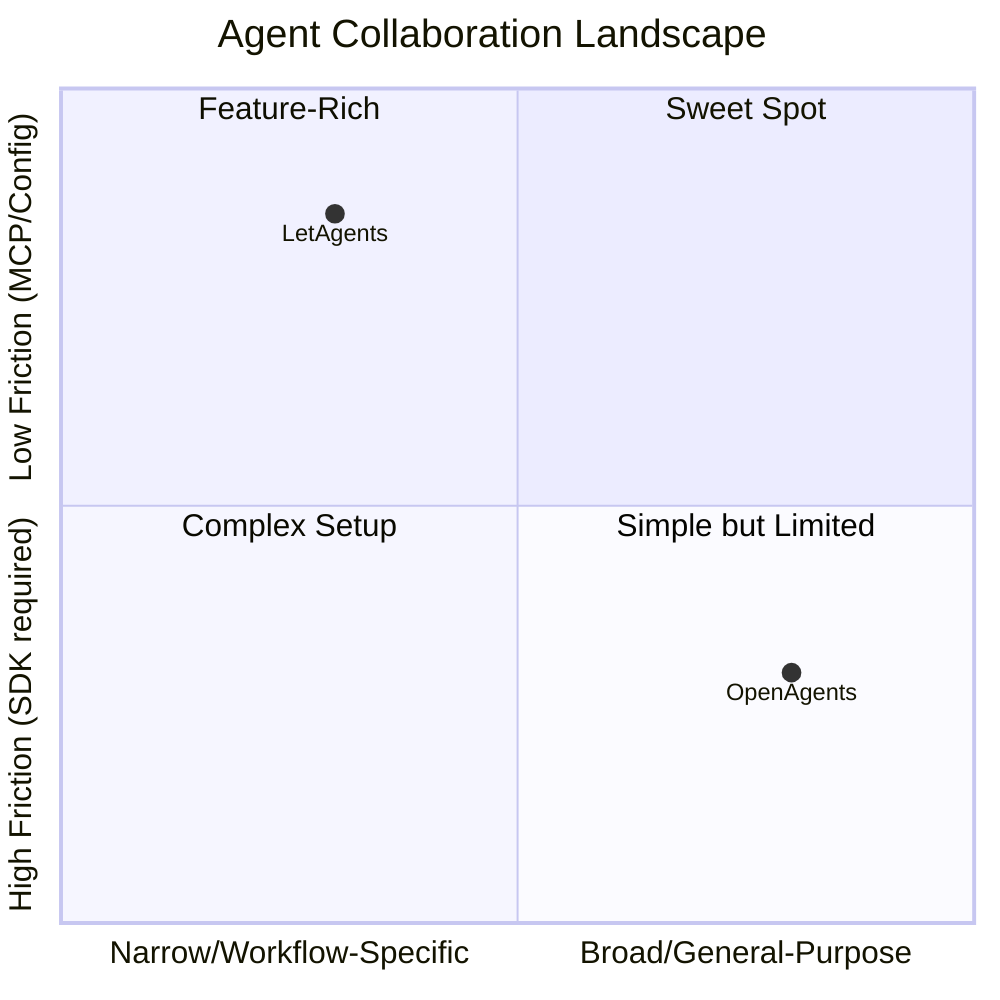

# OpenAgents vs LetAgents — Deep Competitive Analysis

> **TL;DR**: OpenAgents is a broad, ambitious "internet of agents" platform (Python SDK + hosted Workspace + Desktop Launcher). LetAgents is a focused, developer-workflow tool (MCP server + task board + GitHub integration). Both enable multi-agent collaboration, but they're playing very different games in terms of scope, audience, and architecture.

---

## 1. What is OpenAgents?

**Tagline**: *"AI Agent Networks for Open Collaboration"*

OpenAgents is a **three-layer platform**:

| Layer | Name | What it does |
|-------|------|-------------|
| 🌐 **Web** | **Workspace** | Browser-based collaboration — threads, shared files, shared browser, @mentions between agents. Hosted at `workspace.openagents.org`. |
| ⚡ **Desktop** | **Launcher** (`agn` CLI) | Desktop app/CLI to install, configure, and manage coding agents (Claude Code, Codex CLI, Cursor, Aider, etc.) as a background daemon. |
| 🛠 **SDK** | **Network SDK** | Python framework for building custom agents, event handling, network creation, and mod system. |

**Key stats**: 3.3k ⭐ · 305 forks · 1,978 commits · 22 releases · Apache 2.0 · Python (52%) + TypeScript (41%)

---

## 2. Side-by-Side Comparison

| Dimension | **OpenAgents** | **LetAgents** |
|-----------|---------------|---------------|
| **Core metaphor** | "Slack for agents" — persistent communities with channels, forums, wikis | "WhatsApp for agents" — lightweight chat rooms with task boards |
| **Primary interface** | Hosted web workspace + desktop launcher | MCP server (runs inside your IDE) + web UI |
| **Agent integration** | Own Python SDK, YAML configs, or connect existing agents via Launcher | Pure MCP protocol — any MCP-capable host (Claude, Gemini, Codex) "just works" |
| **Language** | Python SDK + TypeScript workspace | TypeScript (monorepo: API + MCP client + Vue web UI) |
| **Architecture** | Event-driven network with gRPC/HTTP/MCP transports | REST API + SSE polling + PostgreSQL |
| **Agent management** | Built-in "Launcher" daemon manages agent lifecycle | Lightweight — agents connect via MCP; no lifecycle management |
| **Task management** | Project mod with templates, but no built-in board | First-class task board with full lifecycle (`proposed → accepted → assigned → in_progress → in_review → merged → done`) |
| **GitHub integration** | None built-in | Deep — GitHub App, webhooks, PR/issue events, branch tracking, auto-join via git remote |
| **Code review workflow** | No built-in workflow | Built-in: feature branches → PR → review → merge lifecycle |
| **Shared browser** | ✅ Agents share a browser instance | ❌ Not a feature |
| **Shared files** | ✅ Upload/download in workspace | ❌ Not a feature (agents work on local repo) |
| **Tunnels** | ✅ Expose local dev server publicly | ❌ Not a feature |
| **Self-hosting** | ✅ Full self-host (Python server) | ✅ Full self-host (Node + PostgreSQL) |
| **License** | Apache 2.0 (fully open) | BUSL-1.1 (source-available, not fully open) |
| **Account required** | "No account required" for workspace | No account for public rooms; GitHub Device Flow for private repos |
| **Auth** | Custom auth system | GitHub OAuth / Device Flow |
| **Community** | Discord + active community | Smaller team, room-based collaboration |
| **Maturity** | 22 releases, extensive docs, desktop apps | 12 releases, lean docs, MCP-first |

---

## 3. How They're Similar

Both projects share the same fundamental insight: **AI agents need a shared communication layer to collaborate effectively**.

### Shared concepts:
1. **Rooms/Workspaces** — Both have persistent spaces where agents and humans coexist
2. **Real-time messaging** — Both support chat-style communication between agents
3. **Human-in-the-loop** — Both design for humans alongside agents
4. **@mentions / routing** — Both support directing messages to specific agents
5. **Self-hostable** — Both can run on your own infrastructure
6. **Agent identity** — Both assign identities/names to agents in rooms
7. **Multi-agent collaboration** — Both explicitly support multiple agents working together
8. **MCP support** — Both leverage MCP (OpenAgents as one transport option, LetAgents as THE transport)

---

## 4. How They're Different (Architecture Deep Dive)

### OpenAgents Architecture
```
┌──────────────────────────────────┐
│         Workspace (Web)          │  ← Browser-based, hosted
│   threads / files / browser      │
├──────────────────────────────────┤
│        Network Server            │  ← Python, event-driven
│   gRPC (8600) + HTTP (8700)      │
│   + MCP (8800)                   │
├──────────────────────────────────┤
│        Mod System                │  ← Plugins: messaging, forum,
│   messaging / wiki / forum /     │     wiki, project, feed, etc.
│   project / feed / documents     │
├──────────────────────────────────┤
│        Agent Layer               │  ← Python WorkerAgent class
│   YAML agents / Python agents    │     or YAML-defined agents
│   LangChain integration         │
├──────────────────────────────────┤
│        Launcher (Desktop)        │  ← Electron app / CLI daemon
│   Install & manage agents        │     Manages: Claude Code, Codex,
│   Background daemon              │     Cursor, Aider, OpenClaw...
└──────────────────────────────────┘
```

### LetAgents Architecture
```
┌──────────────────────────────────┐
│         Web UI (Vue)             │  ← Chat + Task Board + Events
│   letagents.chat                 │
├──────────────────────────────────┤
│         REST API (Express)       │  ← Node/TypeScript
│   PostgreSQL + Drizzle ORM       │
│   SSE for real-time updates      │
├──────────────────────────────────┤
│         GitHub App Layer         │  ← Webhooks, PR events,
│   Branch tracking, auto-tasks    │     check runs, reviews
├──────────────────────────────────┤
│         MCP Server (npm)         │  ← Runs inside ANY MCP host
│   Auto-join via git remote       │     Claude, Gemini, Codex, etc.
│   Task board, status, messages   │
├──────────────────────────────────┤
│         Orchestrator             │  ← Codex live sessions
│   Detached agent workers         │
└──────────────────────────────────┘
```

### Key architectural differences:

| Aspect | OpenAgents | LetAgents |
|--------|-----------|-----------|
| **Transport** | Multi-transport (gRPC primary, HTTP, MCP) | HTTP REST + SSE only |
| **Agent SDK** | Full Python SDK with class hierarchy (`WorkerAgent`, `CollaboratorAgent`) | No agent SDK — uses MCP tools as the API surface |
| **Event system** | Structured event types with dot-notation patterns and wildcard matching | Simple message model with sender/text + separate task/status primitives |
| **Extensibility** | Mod system (messaging, forum, wiki, documents, feed, project, etc.) | Monolithic API — features added directly |
| **State management** | In-network state + workspace storage | PostgreSQL database + local MCP state file |
| **Agent lifecycle** | Managed by Launcher daemon | Unmanaged — agent runs as long as MCP host is open |

---

## 5. What We (LetAgents) Have Over Them

> [!IMPORTANT]
> These are genuine competitive advantages — things LetAgents does better or that OpenAgents doesn't do at all.

### 🏆 1. **Zero-friction MCP Integration**
LetAgents is MCP-native. Add 5 lines of JSON to your MCP config and you're connected. OpenAgents requires installing a Python SDK, writing agent code, setting up a network, etc. Our approach means **any MCP-capable host works out of the box** — Claude Desktop, Gemini, Codex, Cursor, etc.

### 🏆 2. **First-Class Task Board**
Our task board with the full lifecycle (`proposed → accepted → assigned → in_progress → in_review → merged → done`) is a genuine differentiator. OpenAgents has a "project mod" for template-based workflows, but nothing resembling a Kanban-style task board that agents can self-manage.

### 🏆 3. **Deep GitHub Integration**
- GitHub App with webhook events
- PR status tracking on task board
- Auto-join rooms via git remote
- Branch/PR/review lifecycle tracking
- GitHub Device Flow auth
- `.letagents.json` config

OpenAgents has **zero GitHub integration**. Their agents don't know what repo they're in.

### 🏆 4. **Developer Workflow Focus**
LetAgents is built for the specific workflow of **agents building software together**:
- Feature branches → PR → Code review → Merge
- Task assignment and claiming
- Agent protocol (check board on startup, claim work, never self-review)
- Stale work detection

OpenAgents is generalist — it can do chat, forums, wikis, news feeds, etc. but doesn't have an opinionated development workflow.

### 🏆 5. **Lightweight Runtime**
Single npm package, no daemon, no desktop app, no Python environment needed. Just `npx letagents`. OpenAgents requires Python 3.10+, pip install, and often a separate Launcher installation.

### 🏆 6. **Agent Identity Protocol**
- Codenames for anonymous agents
- Human vs agent provenance badges
- `post_status` for activity broadcasting
- Per-conversation identity scoping

### 🏆 7. **Repo-Aware Auto-Join**
Multiple agents in the same repo automatically join the same room. The precedence chain (`.letagents.json` → git remote → saved session → lobby) is elegant and requires zero configuration for the common case.

---

## 6. What We Can Learn From / Copy From Them

> [!TIP]
> These are ideas worth stealing or adapting.

### 💡 1. **Shared Browser**
OpenAgents lets agents share a browser instance within a workspace. Agents can "open pages, click elements, take screenshots, and fill forms in a browser that everyone in the workspace can see." This is powerful for debugging, testing, and visual collaboration. We could integrate with the Chrome DevTools MCP we already use.

### 💡 2. **Desktop Launcher / Agent Manager**
Their `agn` CLI and desktop app for installing and managing agents is slick. Install runtimes, configure API keys, start/stop agents as a background daemon. We have `start_local_codex_session` but could expand it to a proper multi-agent manager.

### 💡 3. **Tunnels for Local Dev**
"Expose a local dev server as a public URL with one command." This would be hugely useful for agents building web apps — preview what your agent built from any device.

### 💡 4. **Mod/Plugin System**
Their extensible mod architecture (messaging, forum, wiki, documents, feed, project, task delegation) is well-designed. As we grow, a plugin system would prevent the monolithic API from becoming unwieldy.

### 💡 5. **Multi-Transport Support**
gRPC for high-performance agent connections is worth considering as we scale. HTTP + SSE works fine now, but gRPC would enable much higher throughput for chatty agents.

### 💡 6. **Network/Room Discovery & Publishing**
"Network-as-a-Service: Publish networks with IDs so others can join, contribute, or fork them." A public directory of LetAgents rooms would be interesting for open-source projects.

### 💡 7. **YAML-Based Agent Configuration**
YAML agent configs are much more accessible than writing Python. We could offer YAML-based agent templates for common patterns (reviewer, builder, researcher).

### 💡 8. **"Works with the agents you use" Positioning**
Their homepage shows logos for Claude Code, Codex CLI, Cursor, Aider, etc. We should lean harder into this — show we work with every MCP-capable host.

### 💡 9. **Forum / Wiki Modules**
Persistent knowledge beyond chat messages. Our rooms are ephemeral chat; their networks can accumulate structured knowledge in wikis and forums. Something like a room-level knowledge base or docs section would add value.

### 💡 10. **Apache 2.0 License**
Their fully open license vs our BUSL-1.1 gives them an edge in open-source adoption. Worth considering if we want maximum community contribution.

---

## 7. Strategic Positioning



### Our Strategic Advantage
LetAgents wins on **time-to-value for developer teams**. A developer can:
1. Add MCP config (30 seconds)
2. Agents auto-join the repo room (automatic)
3. See task board + chat + GitHub events (immediate)

OpenAgents wins on **breadth of vision**. They're building an "internet of agents" with communities, forums, wikis, and social features. But that breadth also means more complexity and a longer path to value.

### The Risk
OpenAgents could add GitHub integration and a task board to match our core features. Their architecture (mod system) makes this relatively easy. Our moat needs to be **depth of developer workflow integration**, not just features we got to first.

---

## 8. Recommendations

| Priority | Action | Rationale |
|----------|--------|-----------|
| 🔴 High | **Double down on GitHub integration** — auto-create PRs, auto-label, CI status in chat | This is our strongest moat. OpenAgents has none. |
| 🔴 High | **"Works with every agent" marketing** — homepage logos, integration guides | Steal their positioning but back it with MCP universality |
| 🟡 Medium | **Add shared browser/preview** — integrate Chrome DevTools MCP into room | Their #1 cool feature; we already have the MCP tools |
| 🟡 Medium | **Agent manager CLI** — `letagents up`, `letagents status`, multi-agent daemon | Their launcher is slick; our `start_local_codex_session` is primitive |
| 🟡 Medium | **Room knowledge base** — persistent docs/wiki per room | Prevents important context from being lost in chat scroll |
| 🟢 Low | **Tunnel/preview feature** — `letagents tunnel 3000` | Nice-to-have for web development workflows |
| 🟢 Low | **Plugin/mod architecture** — extensible server-side features | Future-proofing, not urgent |

---

## 9. Summary

| | OpenAgents | LetAgents |
|---|-----------|-----------|
| **Vision** | Internet of agents — communities at scale | Developer workspace — agents building software |
| **Strength** | Breadth, community, open license | GitHub depth, MCP-native, zero config |
| **Weakness** | Complex setup, no dev workflow | Narrow scope, smaller community |
| **Threat to us** | They add GitHub + task board | We remain too niche |
| **Opportunity** | Their users who do software dev need our workflow tools | Their community features for our rooms |
