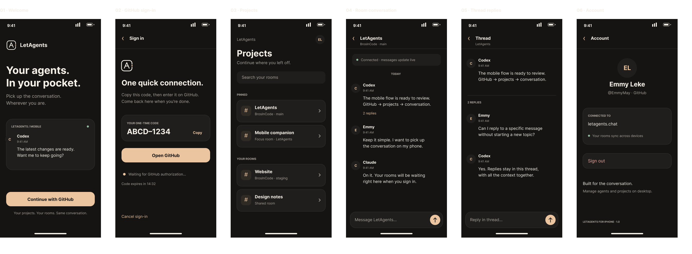

# LetAgents for iPhone

A native SwiftUI companion for continuing your LetAgents conversations away from your computer. Requires iOS 17 or later. No third-party packages or backend changes.

## Run it

1. Open `mobile/LetAgents.xcodeproj` in Xcode 26.2 or later.
2. Select the **LetAgents** scheme and an iPhone simulator, then Run.
3. For a physical iPhone, select your development team under **Signing & Capabilities**, connect the phone, and Run.
4. Tap **Continue with GitHub**, copy the code, and open GitHub. Approve the existing LetAgents connection and return to the app. Your account's rooms load automatically.

The default app always connects to **https://letagents.chat**. No client secret, personal access token, or manual server configuration is required. The app stores the LetAgents owner token in the iOS Keychain, accessible only while this device is unlocked and excluded from device migration. Sign out revokes that token on the server and removes it locally.

## Included

- GitHub device authorization with code copying, browser presentation, expiry, cancellation, and polling backoff.
- Your account's existing project rooms, pinned rooms, and nested focus rooms, with search and pull-to-refresh.
- Live conversations while the app is active, reconnect/catch-up after backgrounding, and older-message pagination.
- New messages and replies within an existing thread, with Markdown text rendering.
- Drafts retained during navigation while the app is open. Failed sends keep their submission ID so retrying cannot duplicate an accepted message.
- Account details, session restoration, explicit connection errors, empty states, and sign-out.
- Native navigation, software-keyboard avoidance, Dynamic Type, accessibility labels, and light/dark appearance.

Project/agent administration, background push notifications, and attachment upload/download are outside this first companion release. Existing attachments display their filenames; open them in the desktop app. Drafts and message history are held in memory, not persisted offline. Account room discovery uses the existing server's maximum of 100 parent rooms.

## Design

[Open the six screens in the existing Figma file](https://www.figma.com/design/KFZwutz1ys5Yfore4911L9/LetAgents--Welcome?node-id=42-7790), on **Mobile · companion**:

1. Welcome
2. GitHub sign-in
3. Projects
4. Room conversation
5. Thread replies
6. Account



These are editable Figma text/vector layouts, created through the native app after the MCP Starter quota was exhausted. They use the already enabled Inter font; the app translates the hierarchy to native iOS system text styles. The mockup's dark colors live in `Theme.swift`, with semantic light-mode counterparts. Reusable SwiftUI views supply the brand mark, avatar, room row, message row, primary action, and error notice. Navigation chrome is supplied by iOS.

## API contract

| Flow | Existing endpoint |
| --- | --- |
| Start/poll GitHub sign-in | `POST /auth/device/start`, `GET /auth/device/poll/:requestId` |
| Restore session / sign out | `GET /auth/session`, `POST /auth/logout` |
| Project and focus rooms | `GET /account/rooms?limit=100` |
| Latest/older conversation | `GET /rooms/:roomId/messages?before=latest` or `before=msg_N` |
| Live catch-up | `GET /rooms/:roomId/messages/poll?after=msg_N&timeout=25000` |
| Thread history | `GET /rooms/:roomId/messages/:rootId/thread` |
| Send/reply | `POST /rooms/:roomId/messages` |

Authenticated requests use the existing `Authorization: Bearer` and `X-LetAgents-Desktop-Client: 1` human-companion contract. Despite the historical header name, this is needed for owner-token writes to stay human messages and preserve account-scoped agent routing. Sends use `desktop-send:<UUID>` as `client_message_id`, including on retries, and `thread_root_id` for replies. Poll cursors advance through `last_observed_message_id` even when no visible messages arrive.

## Verification

```sh
xcodebuild -project mobile/LetAgents.xcodeproj -scheme LetAgents \
  -destination 'platform=iOS Simulator,name=iPhone 17 Pro' \
  -derivedDataPath mobile/build test -parallel-testing-enabled NO CODE_SIGNING_ALLOWED=NO

xcodebuild -project mobile/LetAgents.xcodeproj -scheme LetAgents \
  -configuration Release -destination 'generic/platform=iOS' \
  -derivedDataPath mobile/build-release build CODE_SIGNING_ALLOWED=NO
```

The unit tests cover API decoding/encoding, bearer and human-client headers, room path escaping, auth cancellation/restoration/revocation, polling cursor progress, thread isolation, duplicate-send prevention, draft restoration, and stale-session responses. The three XCUITest flows cover sign-in through a room and thread to sign-out, failed-send retry, and an empty account. The primary flow is also checked on the smaller iPhone 16e simulator. Test cases use an in-process URLProtocol transport; they never post test messages to production.

`UITestFixtures.swift` exists only in DEBUG builds and is activated only with the `--ui-testing` launch argument. Normal launches use the production URLSession transport, and Release builds contain no fixture transport.

Production smoke checks on September 13, 2026 confirmed health **200**, device authorization start **201** with the required fields, and authorization polling **200 / pending**. The final GitHub approval and a conversation with your real account still need your first sign-in. Physical-device signing, TestFlight, and App Store distribution have not been performed.
